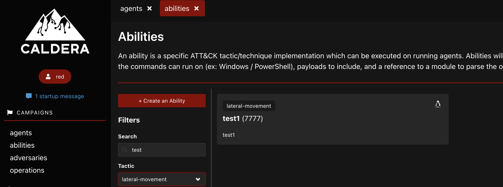
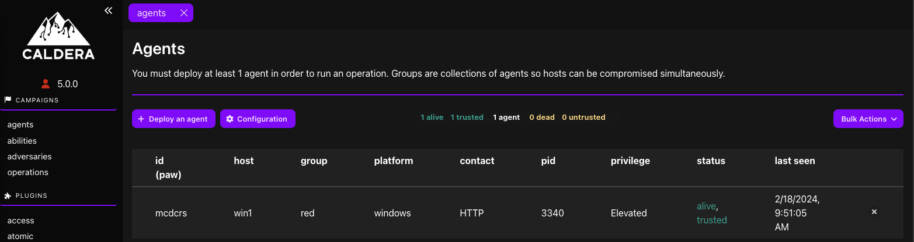
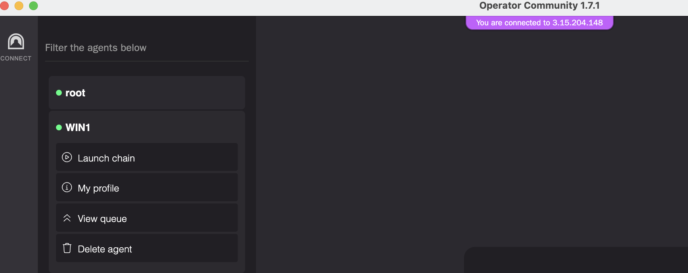
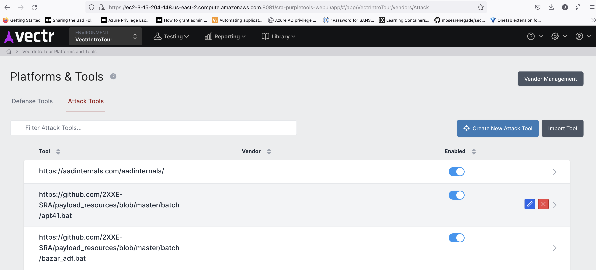

# Automated Emulation

## Overview

Automated Emulation is a simple terraform template creating a customizable and automated Breach and Attack Simulation lab.  It automically builds the following resources hosted in AWS:

* One Linux server deploying Caldera, Prelude Operator Headless, and VECTR
* One Windows Client (Windows Server 2022) auto-configured for Caldera agent deployment, Prelude pneuma, and other Red & Blue tools

See the **Features and Capabilities** section for more details.

## Key Differences

This lab differs from other popular ```Cyber Ranges``` in its design and philosophy.  No secondary tools like Ansible are necessary.  Feel free to use them if you like.  But they aren't required for configuration management.  Instead of using 3rd party configuration management tools, this lab uses terraform providers (AWS SDK) and builtin AWS features (```user data```).  You don't have to rely on a secondary agent or deal with outdated libraries or networking issues with agentless push or updating a secondary tool that causes issues over time.  This increases ```stability, consistency, and speed``` for building and configuring cloud resources.  Use terraform, bash, and powershell to build and configure.  A small user-data script is pushed into the system and runs.  Individual configuration management scripts are uploaded to an S3 bucket.  The master script instructs the system which smaller scripts to run which builds the system.  With good documentation, the location of these scripts should make it easy to add and customize.  See the **Features and Capabilities** section for more details.     

## Requirements and Setup

**Tested with:**

* Mac OS 13.4
* terraform 1.5.7

**Clone this repository:**
```
git clone https://github.com/iknowjason/AutomatedEmulation
```

**Credentials Setup:**

Generate an IAM programmatic access key that has permissions to build resources in your AWS account.  Setup your .env to load these environment variables.  You can also use the direnv tool to hook into your shell and populate the .envrc.  Should look something like this in your .env or .envrc:

```
export AWS_ACCESS_KEY_ID="VALUE"
export AWS_SECRET_ACCESS_KEY="VALUE"
```

## Build and Destroy Resources

### Run terraform init
Change into the AutomatedEmulation working directory and type:

```
terraform init
```

### Run terraform plan or apply
```
terraform apply -auto-approve
```
or
```
terraform plan -out=run.plan
terraform apply run.plan
```

### Destroy resources
```
terraform destroy -auto-approve
```

### View terraform created resources
The lab has been created with important terraform outputs showing services, endpoints, IP addresses, and credentials.  To view them:
```
terraform output
```

## Features and Capabilities

### Important Firewall and White Listing
By default when you run terraform apply, your public IPv4 address is determined via a query to ifconfig.me and the ```terraform.tfstate``` is updated automatically.  If your location changes, simply run ```terraform apply``` to update the security groups with your new public IPv4 address.  If ifconfig.me returns a public IPv6 address,  your terraform will break.  In that case you'll have to customize the white list.  To change the white list for custom rules, update this variable in ```sg.tf```:
```
locals {
  src_ip = "${chomp(data.http.firewall_allowed.response_body)}/32"
  #src_ip = "0.0.0.0/0"
}
```

### Caldera

**Caldera Linux Server**

Caldera is built on an Ubuntu Linux 22.04 AMI automatically.  The following local project files are important for customization:

* bas.tf:  The terraform file that builds the Linux server and all terraform variables for Caldera.
* files/bas/bootstrap.sh.tpl:  The boostrap script for Caldera and other services.
* files/bas/local.yml.tpl:  The Caldera configuration file that is automatically deployed
* files/bas/caldera.service:  The caldera service file that is automatically installed
* files/bas/abilities/:  A local directory with custom abilities that will automatically deploy to the caldera server in ```/opt/caldera/data/abilities```
* files/bas/payloads/:  A local directory with custom payloads that will automatically deploy to the caldera server in ```/opt/caldera/data/payloads```

**Troubleshooting Caldera:**

SSH into the Caldera server by looking in ```terraform output``` for this line:  
```
ssh -i ssh_key.pem ubuntu@3.15.204.148
```
Once in the system, tail the user-data logfile.  You will see the steps from the ```bootstrap.sh.tpl``` script running:
```
tail -f /var/log/user-data.log
```

**Customiz Caldera Linux:**

To customize Caldera, you can modify the default admin credentials for red, blue and api keys in ```bas.tf```.  For other customizations, you can modify the ```local.yml.tpl``` Caldera configuration file.

You can create custom abilities in your project that get automatically loaded into Caldera.  This image shows a custom ability for lateral-movement that is built locally from ```files/bas/abilities/lateral-movement/```.



**Teraform Output:**

View the terraform outputs for important Caldera access information:
```
Caldera Console
-------
http://3.15.204.148:9999

Caldera Console Credentials
-------------------
blue:Caldera2023
red:Caldera2023
admin:Caldera2023

API Keys
--------
api_key_blue: blueadmin2023
api_key_red: redamin2023
```
**Caldera on Windows Client:**

The Caldera sandcat agent is automatically installed and launches on the Windows client system.  The bootstrap script waits until Caldera is up and available, then installs Sandcat caldera agent.  It should look like this.




To troubleshoot this, look in the following logfile on the Windows system:  
```
C:\Terraform\prelude_log.log
```

To modify this file locally, it is located in ```files\windows\prelude.ps1.tpl```

### Prelude

**Prelude Headless Linux Server**

Prelude Operator Headless is built on an Ubuntu Linux 22.04 AMI automatically.  The following local project files are important for customization:

* bas.tf:  The terraform file that builds the Linux server and all terraform variables for Operator.
* files/bas/bootstrap.sh.tpl:  The boostrap script for Prelude headless and other services.
* files/bas/operator.service.tpl:  The operator service file that is automatically installed

**Prelude Desktop UI Setup through manual cloud redirector:**

**Mandatory Configuration Changes:**

Each Prelude instance has a unique email address and the terraform variable needs to be changed.  In ```bas.tf```, change the following variable to match the email address used within the instance of your Prelude Desktop UI client:
```
variable "operator_email" {
  description = "The email address for Prelude Operator Desktop UI client"
  default     = "1b0743d7-6d2a-4963-abc4-388474423b78@desktop.prelude.org"
}
```

The Prelude headless services and configuration are automatically deployed.  A Pneuma agent is served on a port that the Windows client uses to automatically download and install this agent.  To setup Prelude Desktop UI, you need to configure the cloud redirector:

1. Go to ```Connect``` in top left corner
2. Go to ```Deploy Redirectors``` on the right
3. Under ```Manual Headless Operator```, fill in the IP and token
4. The IP and token is taken from the ```terraform output``` and should look like this:
```
Operator Headless Prelude Desktop UI
-----------------
IP: 3.15.204.148
Token: c78cf931-cc89-8e00-94a7-f1c236996aa6
Email: 1b0743d7-6d2a-4963-abc4-388474423b78@desktop.prelude.org
```
5. Hit ```provision``` after filling in IP and token
6. Look for the redirector IP on the right side and click on it
7. Hit ```Connect``` at the bottom

You should now see the pneuma agent connected from your Windows client system through the cloud redirector:



**Troubleshooting Prelude:**

SSH into the Caldera server by looking in ```terraform output``` for this line:  
```
ssh -i ssh_key.pem ubuntu@3.15.204.148
```
Once in the system, tail the user-data logfile.  You will see the steps from the ```bootstrap.sh.tpl``` script running:
```
tail -f /var/log/user-data.log
```

**Teraform Output:**

View the terraform outputs for important Operator access information:
```
Operator Headless Prelude Desktop UI
-----------------
IP: 3.15.204.148
Token: c78cf931-cc89-8e00-94a7-f1c236996aa6
Email: 1b0743d7-6d2a-4963-abc4-388474423b78@desktop.prelude.org
```
**Operator on Windows Client:**

The pneuma agent is automatically installed and launches on the Windows client system.  The bootstrap script waits until the headless operator is up and available, then installs the pneuma agent.  The prelude desktop UI agent on Windows is also installed.  This installer local file is:

```
files/bas/prelude-operator-1.7.1-x64.exe
```

To troubleshoot this, look in the following logfile on the Windows system:  
```
C:\Terraform\prelude_log.log
```

To modify this file locally, it is located in ```files\windows\prelude.ps1.tpl```

### VECTR

VECTR by Security Risk Advisors is installed automatically.  From their Github repo:

_VECTR is a tool that facilitates tracking of your red and blue team testing activities to measure detection and prevention capabilities across different attack scenarios_



Take a look at the terraform output to see the public URL and credentials for accessing VECTR:
```
VECTR Console
-------------
https://ec2-3-15-204-148.us-east-2.compute.amazonaws.com:8081

VECTR Credentials
-----------------
admin:11_ThisIsTheFirstPassword_11
```

### Red Tools

On the Windows Client system, the following tools are automatically deployed into ```C:\Tools\```:

* Atomic Red Team (ART)
* PurpleSharp

The local bootstrap script for customization is ```files\windows\red.ps1.tpl```

To track monitoring of the deployment on the Windows Client, see the logfile at ```C:\Terraform\red_log.log```

### Blue Tools

Sysmon service and customized configuration (SwiftOnSecurity) is deployed onto the Windows Client system.  To update the sysmon version and configuration, make changes inside the ```files\sysmon``` directory.

The local bootstrap script for customization is ```files\windows\sysmon.ps1.tpl```

To track monitoring of the deployment on the Windows Client, see the logfile at ```C:\Terraform\blue_log.log```

### Windows Client

The Windows Client system is built from ```win1.tf```.  Windows Server 2022 Datacenter edition is currently used.  You can upload your own AMI image and change the data reference in win1.tf.  The local bootstrap script is located in ```files/windows/bootstrap-win.ps1.tpl```.  RDP into the Windows system and follow this logfile to see how the system is bootstrapping:

```
C:\Terraform\bootstrap_log.log
```

**Customizing Build Scripts**

For adding new scripts for a customized deployment, reference the arrays in ```scripts.tf``` and ```s3.tf```.  For more complex deployments, the Windows system is built to have flexibility for adding customized scripts for post-deployment configuration management.  This gets around the size limit of user-data not exceeding 16KB in size.  The s3 bucket is used for staging to upload and download scripts, files, and any artifacts needed.  How this is done:  A small master script is always deployed via user-data.  This script has instructions to download additional scripts.  This is under your control and is configured in ```scripts.tf``` and ```s3.tf```.  In ```scripts.tf```, take a look at the array called ```templatefiles```.  Add any custom terraform templatefiles here and then add them locally to ```files/windows```.  See the ```red.ps1.tpl``` and ```sysmon.ps1.tpl``` files as an example.  The file should end in ```tpl```.  This template file is generated as output into the directory called ```output```.  The terraform code strips off the ```.tpl``` in the filename when it generates into the ```output``` directory.  Make sure the filename is correct because the master script downloads based on this name.  In ```s3.tf```, each little script referenced in ```templatefiles``` is uploaded.  The master bootstrap script has a reference to this array.  It will automatically download all generated scripts from the ```templatefiles``` array and execute each script.

**Terraform Outputs**

See the output from ```terraform output``` to get the IP address and credentials for RDP:
```
-------------------------
Virtual Machine win1
-------------------------
Instance ID: i-0eecf5439b1d8080b
Computer Name:  win1
Private IP: 10.100.20.10
Public IP:  18.119.101.237
local Admin:  RTCAdmin
local password: wOFVYKYlk2
```

### Linux

The linux system is built from ```bas.tf```.  The bootstrap script is located in ```files/bas/bootstrap.sh.tpl```.

To access the Linux system and troubleshoot any bootstrap issues, SSH into the system by looking at the terraform output:

```
SSH
---
ssh -i ssh_key.pem ubuntu@3.15.204.148
```

Then tail the user-data logfile to monitor any potential issues with the bootstrap script:

```
tail -f /var/log/user-data.log
```

### Future

This terraform was automatically generated by the Operator Lab tool.  To get future releases of the tool, follow twitter.com/securitypuck.

For an Azure version of this tool, check out PurpleCloud (https://www.purplecloud.network)


